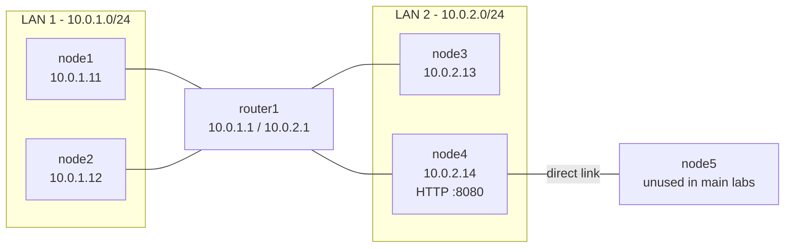
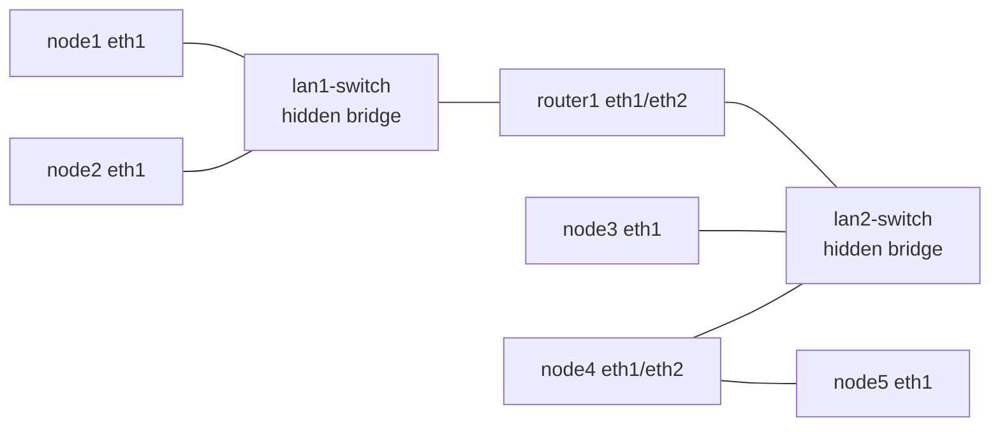
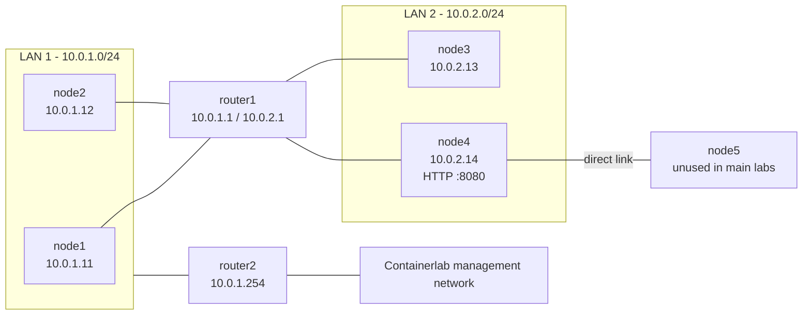

# Networking tutorial participant handout

## Getting started in Guacamole

Log in to Apache Guacamole and open your assigned server group, for example
`server01`.

Inside your server group you will see lab groups such as `lab00` through
`lab06`. Each lab group contains node connections named like `lab03 - node1`.
Open the node connections requested by the exercise.

Some accounts may also show `serverNN admin`. You do not need it for the main
tutorial. It is only for advanced manual control of the lab VM.

## Networking layers in this tutorial

The OSI model is a way to separate network jobs into layers. This tutorial
mostly uses the first four:

| Layer | Name | What to watch in the labs |
| --- | --- | --- |
| 1 | Physical | A link or interface exists. In this lab, Containerlab creates virtual links. |
| 2 | Data link | Ethernet frames, MAC addresses, local LANs, and ARP. |
| 3 | Network | IP addresses, subnets, routes, and gateways. |
| 4 | Transport | TCP ports, such as the HTTP server on port `8080`. |

Layers 5 through 7 are where sessions, presentation details, and applications
live. We touch Layer 7 only briefly when using HTTP with `curl`.

## Topology

The main teaching view hides the implementation switches:



Containerlab implements the shared LANs with hidden bridge nodes:



Lab06 adds `router2` on LAN 1 as the NAT gateway exercise:



Addressing used by the checkpoint labs:

| Node | Interface | Address | Notes |
| --- | --- | --- | --- |
| `node1` | `eth1` | `10.0.1.11/24` | Fixed MAC `0a:00:00:00:00:01` |
| `node2` | `eth1` | `10.0.1.12/24` | Fixed MAC `0a:00:00:00:00:02` |
| `router1` | `eth1` | `10.0.1.1/24` | LAN 1 gateway |
| `router1` | `eth2` | `10.0.2.1/24` | LAN 2 gateway |
| `node3` | `eth1` | `10.0.2.13/24` | LAN 2 host |
| `node4` | `eth1` | `10.0.2.14/24` | LAN 2 host and HTTP server |
| `node4` | `eth2` | none in labs 0-6 | Direct link to `node5` |
| `node5` | `eth1` | none in labs 0-6 | Direct link to `node4` |
| `router2` | `eth1` | `10.0.1.254/24` | Configured by participants in lab06 |
| `router2` | `eth0` | Containerlab management address | Present only in lab06 |

## How local and routed traffic uses addresses

Every packet in these labs has both Layer 3 IP addresses and Layer 2 MAC
addresses while it is crossing one LAN.

If the destination IP is in the same local subnet, the host sends directly to
the destination MAC address. For example, when `node1` sends to `10.0.1.12`,
it uses ARP to learn `node2`'s MAC address, then sends the Ethernet frame to
`node2`.

If the destination IP is outside the local subnet, the host sends the Ethernet
frame to its gateway MAC address. The IP destination still stays as the final
remote host. For example, when `node1` sends to `10.0.2.14`, the destination IP
is `10.0.2.14`, but the first Ethernet frame on LAN 1 goes to `router1`'s MAC
address.

## Exercise 0: Orientation

Open `lab00` in Guacamole and connect to `node1`, `node2`, `router1`, and
`node4`.

This lab has the full topology, but no tutorial IP addresses, routes, services,
or firewall rules. Your task is to inspect what exists before configuration.

Run these commands on several nodes:

```bash
hostname
ip -br link
ip addr
ip route
```

Questions:

- Which interfaces exist on each node?
- Which interfaces are down?
- Does any node already have a `10.0.x.x` address?
- Does any node have a default route?

Expected result: you can identify machines and interfaces, but useful IP
networking is not configured yet.

## Exercise 1: First IP addresses

Continue in `lab00`.

Target result: LAN 1 is configured like checkpoint `lab01`.

On `node1`:

```bash
ip link set eth1 up
ip addr add 10.0.1.11/24 dev eth1
ip addr show eth1
```

On `node2`:

```bash
ip link set eth1 up
ip addr add 10.0.1.12/24 dev eth1
ip addr show eth1
```

On `router1`:

```bash
ip link set eth1 up
ip addr add 10.0.1.1/24 dev eth1
ip addr show eth1
```

Check from `node1`:

```bash
ping -c 3 10.0.1.12
ping -c 3 10.0.1.1
ip neigh
```

Questions:

- What does `/24` mean for the local network?
- Why can `node1` reach `node2` without a router?
- Which MAC address belongs to `node2`?

## Exercise 2: Local reachability and ARP

Open checkpoint `lab01`.

Target result: LAN 1 and LAN 2 are configured like checkpoint `lab02`.

On `node3`:

```bash
ip link set eth1 up
ip addr add 10.0.2.13/24 dev eth1
```

On `node4`:

```bash
ip link set eth1 up
ip addr add 10.0.2.14/24 dev eth1
ip link set eth2 up
```

On `node5`:

```bash
ip link set eth1 up
```

On `router1`:

```bash
ip link set eth2 up
ip addr add 10.0.2.1/24 dev eth2
```

Check from `node3`:

```bash
ping -c 3 10.0.2.14
ping -c 3 10.0.2.1
ip neigh
```

Optional observation on `node3`, then ping again from another shell:

```bash
tcpdump -ni eth1 arp or icmp
```

Questions:

- What changes in `ip neigh` after a successful ping?
- Why can `node3` reach `node4`, but `node1` cannot yet reach `node4`?
- What failure do you see if an interface is still down?

## Exercise 3: Routing between LANs

Open checkpoint `lab02`.

Target result: hosts can reach the other LAN through `router1`, like checkpoint
`lab03`.

On `router1`:

```bash
sysctl -w net.ipv4.ip_forward=1
```

On `node1` and `node2`:

```bash
ip route add default via 10.0.1.1
ip route
```

On `node3` and `node4`:

```bash
ip route add default via 10.0.2.1
ip route
```

Check from `node1`:

```bash
ip route get 10.0.2.14
ping -c 3 10.0.2.14
traceroute 10.0.2.14
```

Questions:

- Which traffic stays inside LAN 1?
- Which traffic needs `router1`?
- What changes when forwarding is enabled on `router1`?

## Exercise 4: TCP service and ports

Open checkpoint `lab03`.

Target result: `node4` serves HTTP on port `8080`, like checkpoint `lab04`.

On `node4`:

```bash
mkdir -p /tmp/lab-http
echo "hello from node4" >/tmp/lab-http/index.html
python3 -m http.server 8080 --bind 10.0.2.14 --directory /tmp/lab-http
```

Leave that command running. Open another `node4` connection and run:

```bash
ss -ltnp
```

From `node1`:

```bash
curl http://10.0.2.14:8080/
curl --connect-timeout 3 http://10.0.2.14:9999/
```

Questions:

- What does the port number identify?
- How is "connection refused" different from "no route" or a timeout?
- Which command shows the listening socket on `node4`?

## Exercise 5: Firewall basics

Open checkpoint `lab04`.

Target result: only `node1` can reach `node4:8080`, like checkpoint `lab05`.

On `node4`:

```bash
ufw default allow incoming
ufw allow from 10.0.1.11 to any port 8080 proto tcp
ufw deny 8080/tcp
ufw --force enable
ufw status numbered
```

The specific allow rule for `node1` must come before the broader deny rule for
port `8080`.

From `node1`:

```bash
curl http://10.0.2.14:8080/
```

From `node2`:

```bash
curl --connect-timeout 3 http://10.0.2.14:8080/
```

Questions:

- Why does `node1` still work?
- Why does `node2` fail even though routing and the service are present?
- Which packet fields does this firewall rule inspect?

## Exercise 6: NAT gateway

Open checkpoint `lab06`.

This checkpoint starts like `lab05`, but adds `router2` to LAN 1. `router2` has
a Containerlab management interface, `eth0`, and an unconfigured LAN 1
interface, `eth1`.

Target result: `router2` becomes the NAT gateway for both LAN 1 and LAN 2.

On `router2`, inspect the interfaces:

```bash
ip -br addr
ip route
```

On `router2`, configure the LAN 1 interface and forwarding:

```bash
ip link set eth1 up
ip addr add 10.0.1.254/24 dev eth1
sysctl -w net.ipv4.ip_forward=1
```

On `router2`, add a route back to LAN 2 through `router1`:

```bash
ip route add 10.0.2.0/24 via 10.0.1.1
```

On `router2`, add NAT for the two lab networks:

```bash
iptables -t nat -A POSTROUTING -s 10.0.1.0/24 -o eth0 -j MASQUERADE
iptables -t nat -A POSTROUTING -s 10.0.2.0/24 -o eth0 -j MASQUERADE
iptables -t nat -S
```

`MASQUERADE` rewrites the packet source address to `router2`'s outgoing address
on `eth0`.

On `node1` and `node2`, replace the default route:

```bash
ip route replace default via 10.0.1.254
ip route
```

On `router1`, add the default route toward `router2`:

```bash
ip route replace default via 10.0.1.254
ip route
```

Keep `node3` and `node4` using `10.0.2.1` as their default gateway.

Check the result:

```bash
# node1
ping -c 3 10.0.1.254
ping -c 3 10.0.2.14

# node3
ping -c 3 10.0.1.254

# router2
ip route
iptables -t nat -S
```

If DNS is available through the management network, also test from `node1`:

```bash
curl --connect-timeout 5 http://example.com/
```

Questions:

- Why does `router2` need a route to `10.0.2.0/24`?
- Why do `node3` and `node4` still use `router1` as their default gateway?
- What changes in the packet source address when NAT is applied?

## Appendix: advanced admin connection

The main tutorial uses Guacamole node connections. Advanced participants may use
the optional `serverNN admin` connection when it is visible.

Useful commands:

```bash
clab-lab run lab00
clab-lab run lab03
clab-lab run lab06
clab-lab destroy --all
clab-lab run-shell lab03 node1
```

`clab-lab run labXX` destroys other running labs and starts the selected
checkpoint. Use it only when you intentionally want to reset the VM lab state.
